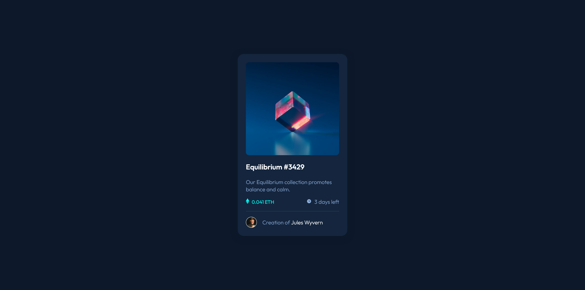

# Frontend Mentor - NFT preview card component solution

This is a solution to the [NFT preview card component challenge on Frontend Mentor](https://www.frontendmentor.io/challenges/nft-preview-card-component-SbdUL_w0U). Frontend Mentor challenges help you improve your coding skills by building realistic projects.

## Table of contents

- [Overview](#overview)
  - [The challenge](#the-challenge)
  - [Screenshot](#screenshot)
  - [Links](#links)
- [My process](#my-process)
  - [Built with](#built-with)
  - [What I learned](#what-i-learned)
  - [Useful resources](#useful-resources)
- [Author](#author)

## Overview

### The challenge

Users should be able to:

- View the optimal layout depending on their device's screen size
- See hover states for interactive elements

### Screenshot




### Links

- Solution URL: [Github repo](https://github.com/funficient/fem-nft-card-component)
- Live Site URL: [Github pages](https://funficient.github.io/fem-nft-card-component/)

## My process

### Built with

- Semantic HTML5 markup
- CSS custom properties
- Flexbox
- CSS Grid
- Mobile-first workflow

### What I learned

Struggled with the on hover effect for the image. Starting to understand how to use position: relative and absolute with inheritance.

```html
<div class="image-container">
  
  <div class="image-overlay">
    
  </div>
</div>
```

```css
.image-container {
  position: relative;
}

.image-overlay {
  display: flex;
  align-items: center;
  justify-content: center;
  flex-direction: column;
  position: absolute;
  top: 0;
  left: 0;
  background-color: hsla(178, 100%, 50%, 0.5);
  opacity: 0;
  border-radius: 0.5em;
  width: 100%;
  height: 100%;
  background-image: url("assets/icon-view.svg") no-repeat center;
  transition: 0.4s ease-in-out;
}
```

### Useful resources

[Solution by @correlucas](https://www.frontendmentor.io/solutions/nft-preview-card-vanilla-css-custom-design-and-hover-effects-zVKSAE5IXI) - After struggling a while, I finally figured out how to handle the hover effect by looking at another example of a good solution by Lucas.

## Author

- Website - [Kate Dames](https://www.funficient.com)
- Frontend Mentor - [@funficient](https://www.frontendmentor.io/profile/funficient)
